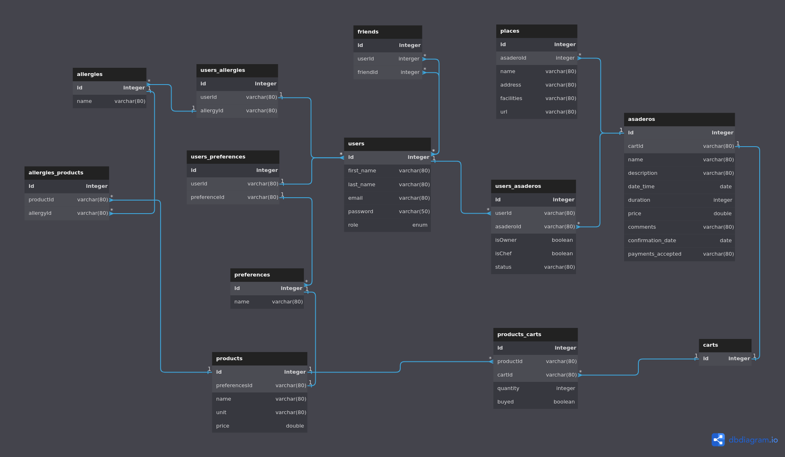

# Appsadero

## DESCRIPTION

Appsadero is an application that allows you to manage in an optimised way to make an expensive task into something easy and dynamic.

- Manage the people invited, and have them reject or accept the invitation.

- Control the payments of the guests to make up the shopping list.

- Automate the quantities of products and the final price according to the people invited.


>## DIAGRAM


>## Route
The routes we have defined from Routes is **router.use** index.js accompanied by:
- **/profile** - To access the profile as a user
- **//** - Admin access to user management functions
- **/auth** - Signup or Login
- **/asadero** - All matters relating to grill
- **/place** - All matters relating to place for organazing grill
- **/preference** - Access to the product's categories
- **/product** - All matters relating to the products
- **/cart** - Access to the shopping cart of a certain grill
- **/allergy** - Access to the allergies
- **/friend** - All matters relating to an users with their friends


#### CRUD of Auth
```js
router.post('/signup', signUp) //Executes the function to register a new user.
router.post('/login', logIn) // Executes the function that allows a registered user to log in
```

>## Models
Below each model is equivalent to a Database's table with its fields and data parameters.

<details><summary><b>User</b></summary>

### User's model

- **id** (type: <em>INTEGER</em>, primaryKey: <em>true</em>, autoIncrement: <em>true</em>)
- **first_name** (type: <em>STRING</em>, allowNull: <em>false</em>)
- **last_name** (type: <em>STRING</em>, allowNull: <em>false</em>)
- **email** (type: <em>STRING</em>, allowNull: <em>false</em>, Unique, validate: <em>isEmail</em>)
- **password** (type: <em>STRING</em>, allowNull: <em>false</em>, validate: regex (<em>Minimum eight characters, at least one uppercase letter, one lowercase letter, one number and one special character</em>))

### CRUD of User
```js
router.get('/', checkAuth, getAllProfiles) // Verify that the user is registered and show all profiles
router.get('/:email', checkAuth , getOneProfile) // Verifies that the user is logged in and shows only one user
router.delete('/:userId', checkAuth, deleteProfile)
/* There is not http verb .post because a normal user cannot create another user.*/
```

### CRUD of Admin
```js
router.post("/", checkAuth, checkAdmin, createNewUser) //Verified that he/she is Admin, can create a new user
router.put("/:userId", checkAuth, checkAdmin, updateUser) // Verified that he/she is Admin, can update a user
router.delete('/:userId', checkAuth, checkAdmin, deleteUser)  // Verified that he/she is Admin, can delete a user
```
</details>

<details> <summary><b>Asadero</b></summary>

### Asadero's model

- **id** (type: <em>INTEGER</em>, primaryKey: <em>true</em>, autoIncrement: <em>true</em>)
- **name** (type: <em>STRING</em>, allowNull: <em>false</em>, Unique)
- **description** (type: <em>TEXT</em>, allowNull: <em>false</em>)
- **date_time** (type: <em>DATEONLY</em>, allowNull: <em>false</em>, validate: <em>isDate</em>)
- **duration** (type: <em>INTEGER</em>, allowNull: <em>false</em>)
- **price** (type: <em>DOUBLE</em>, allowNull: <em>false</em>)
- **comments** (type: <em>TEXT</em>, allowNull: <em>false</em>)
- **confirmation_date** (type: <em>DATEONLY</em>, allowNull: <em>false</em>, validate: <em>isDate</em>)
- **payments_accepted** (type: <em>STRING</em>, allowNull: <em>true</em>)ç

### CRUD of Asadero
```js
router.get('/', checkAuth, checkAdmin, getAllAsaderos) // Only the administrator can see all the barbecues
router.get('/myAsaderos', checkAuth, getAllMyAsaderos) // the user can see all the barbecues where he/she is
router.get("/:asaderoId", checkAuth, checkAdmin, getOneAsadero) // Only the administrator can see any barbecue
router.get("/:asaderoId/users", checkAuth, getUsersFromAsadero) // Show all users from an barbecue
router.put("/:asaderoId/user/:userId", checkAuth, udpateUserFromAsadero) // Update user from an barbecue
router.put('/:asaderoId', checkAuth, updateAsadero) //checkOwner // Update barbecue
router.post('/', checkAuth, createAsadero) // Create new barbecue
router.post("/:asaderoId/user/:userId", checkAuth, addUserToAsadero)//checkOwner, // Add guests to a barbecue
router.delete('/:asaderoId', checkAuth, deleteAsadero) //checkOwner, // Delete barbecue
router.delete("/:asaderoId/user/:userId", checkAuth, deleteUserFromAsadero); //checkOwner // Delete user from a barbecue
```
</details>

<details> <summary><b>User_Asadero</b></summary>

### User_Asadero's model
- **id** (type: <em>INTEGER</em>, primaryKey: <em>true</em>, autoIncrement: <em>true</em>)
- **isOwner** (type: <em>BOOLEAN</em>, defaultValue: <em>false</em>)
- **isChef** (type: <em>BOOLEAN</em>, defaultValue: <em>false</em>)
- **status** (type: <em>ENUM</em>('pending', 'confirmed', 'paid', 'rejected'), defaultValue: <em>"pending"</em>)
- **userId** (type: <em>INTEGER</em>, foreingKey(<em>User</em>))
- **asaderoId** (type: <em>INTEGER</em>, foreingKey(<em>Asadero</em>))

</details>
<details> <summary><b>Product</b></summary>

### Product's model
- **id** (type: <em>INTEGER</em>, primaryKey: <em>true</em>, autoIncrement: <em>true</em>)
- **name** (type: <em>STRING</em>, allowNull: <em>false</em>)
- **unit** (type: <em>STRING</em>, defaultValue: <em>ud</em>)
- **price** (type: <em>DOUBLE</em>, defaultValue: 0)

#### CRUD of Product
```js
router.get("/", checkAuth, getAllProducts) //Get all products
router.get("/:productId", checkAuth, getOneProduct) //Get one products
router.post("/", checkAuth, createProduct) //Create a product if does not exist
router.post('/bulk', checkAuth, checkAdmin, bulkCreateProduct) //Create many products
router.put("/:productId", checkAuth, checkAdmin, updateProduct) //Verified that he/she is Admin, can update Product
router.delete("/:productId", checkAuth, checkAdmin, deleteProduct) //Verified that he/she is Admin, can delete Product
```
</details>

<details> <summary><b>Cart</b></summary>

### Cart's model
- **id** (type: <em>INTEGER</em>, primaryKey: <em>true</em>, autoIncrement: <em>true</em>)

#### CRUD of Cart
```js
router.get("/", checkAuth, checkAdmin, getAllCart) //Get all carts
router.get("/:cartId", checkAuth, getOneCart) //Get one cart
router.get('/:cartId/products', checkAuth, getAllProdcutsFromCart) //Get all products from a cart
router.post("/", checkAuth, checkAdmin, createCart) // Only admin can create a cart without creating first an asadero
router.put('/:cartId/product/:productId', checkAuth, addProductsToCart) // Add product to an cart
router.delete("/:cartId", checkAuth, checkAdmin, deleteCart) // Only ADMIN can delete cart
router.delete('/:cartId/product/:productId', checkAuth, deleteProductFromCart) // Delete product from cart
```
</details>

<details> <summary><b>Product_Carts</b></summary>

### Products_Carts's model
- **id** (type: <em>INTEGER</em>, primaryKey: <em>true</em>, autoIncrement: <em>true</em>)
- **productId** (type: <em>INTEGER</em>, foreingKey)
- **cartId** (type: <em>INTEGER</em>, foreingKey (<em>Cart</em>))
- **quantity** (type: <em>INTEGER</em>,  allowNull: <em>true</em>, defaultValue: 0)
- **buyed** (type: <em>BOOLEAN</em>, allowNull: <em>true</em>, defaultValue: 0)

</details>

<details> <summary><b>Product_Carts</b></summary>

### Place's model
- **id** (type: <em>INTEGER</em>, primaryKey: <em>true</em>, autoIncrement: <em>true</em>)
- **name** (type: <em>STRING</em>, allowNull: <em>false</em>)
- **address** (type: <em>STRING</em>, allowNull: <em>false</em>)
- **facilities** (type: <em>STRING</em>, allowNull: <em>false</em>)
- **url** (type: <em>STRING</em>, allowNull: <em>false</em>, validate: <em>isUrl</em>)

### CRUD of Place
```js
router.get("/", checkAuth, getAllPlaces);
router.get("/:placeId", checkAuth, getOnePlace);
router.post("/", checkAuth, createPlace); 
router.put("/:placeId", checkAuth, updatePlace);
router.delete("/:placeId", checkAuth, checkAdmin, deletePlace);
```

</details>

<details> <summary><b>Preference</b></summary>

### Preference's model
- **id** (type: <em>INTEGER</em>, primaryKey: <em>true</em>, autoIncrement: <em>true</em>)
- **name** (type: <em>STRING</em>, allowNull: <em>false</em>)

### CRUD of Preference
```js
router.get('/', checkAuth, getAllPreferences)
router.get('/:preferenceId', checkAuth, getOnePreference)
router.post('/', checkAuth, checkAdmin, createPreference)
router.post('/bulk', checkAuth, checkAdmin, bulkCreatePreference)
router.put('/:preferenceId', checkAuth, checkAdmin, updatePreference)
router.delete('/:preferenceId', checkAuth, checkAdmin, deletePreference)
```
</details>


<details> <summary><b>Allergies</b></summary>

### Allergies's model
- **id** (type: <em>INTEGER</em>, primaryKey: <em>true</em>, autoIncrement: <em>true</em>)
- **name** (type: <em>STRING</em>, allowNull: <em>false</em>)
```js

router.get("/", checkAuth, getAllAllergies);  //All users
router.get("/:allergyId", checkAuth, getOneAllergy); //Get one All users
router.post("/", checkAuth, checkAdmin, createAllergy); // Create only admin
router.put("/:allergyId", checkAuth, checkAdmin, updateAllergy); // Update only admin
router.delete("/:allergyId", checkAuth, checkAdmin, deleteAllergy); // Delete only admin
``` 

</details>


<br>


## CREATORS
--------------
### Diana Tabraue Rubio
><https://github.com/tabraue>
### Abel López Pérez
><https://github.com/Grancan91>

### Pedro Adasat Bonilla Bolaños
><https://github.com/Adasat>


